# Hackathon Documentation

## Introduction

This document will guide you in using (Fusionex GIANT] (https://www.fusionexgiant.com/) as your analytics platform. 

>  **What you'll learn:** ETL stands for Extract, Transform, Load. It is the procedure by which data is obtained from one or more sources, aggregated into useful data and then stored in a data warehouse for later analysis. ETL is a crucial fundamentals step that makes data analytics possible.

## What is Giant?

GIANT is an easy to use analytics platform that enables companies to derive insights by performing analysis on vast amounts of data (also known as big data). This allows companies to pin point ways to improve their operations and determine new business opportunities.

# **LETS BEGIN!**

## 1) Loading Your Data

The data we are going to use is a retail dataset. This is an example of a dataset a retailer company might collect. The dataset consists of 5,000 rows and 21 columns.

The first thing to do is to load your data into GIANT. To do this, click on the **"Connect to Source(s)"** tab on the left sidebar. 

> *If the sidebar cant be seen, on the top left of the screen click on the green button with the three white lines.*

You will see **New Connection Source** main page since you haven't add any data yet. In the screen, there are a variety of data connectors available.

Click on the **"Comma Delimited"** option. 

> Protip: GIANT offers many ways to load data from various databases to the analytics platform DO EXPLORE yourself! 

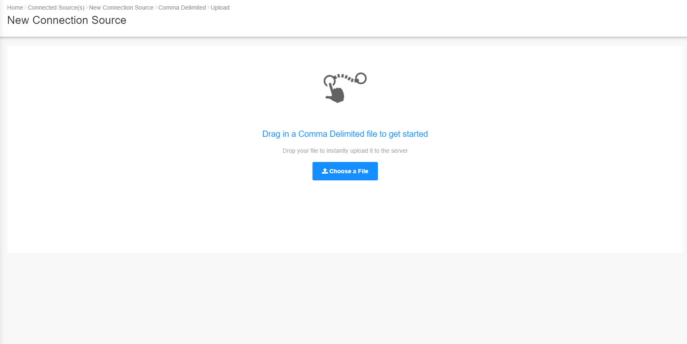

In the next screen shown above, upload your data by either dragging and dropping the data source file from the windows explorer into the screen OR browse to choose the data source file.

If your data upload is successful, a message in a green box will appear on the top right of the screen to indicate that the file upload is completed. To view your data, click on the **"Connect to Source(s)"** tab again on the left sidebar.

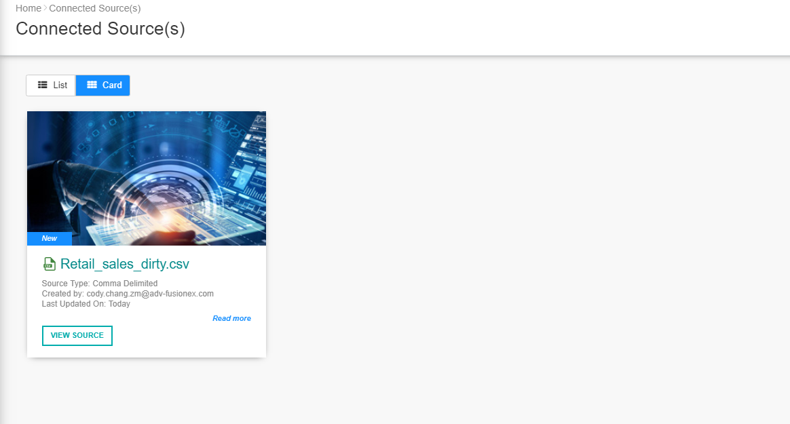

> In the event of large data size, do give it sometime. ;)

## 2) Viewing and Transforming Your Data

Lets have a look at our data, click on the **"View Source"** button of the data source you've uploaded. 

Take a look at the table columns and their values. 

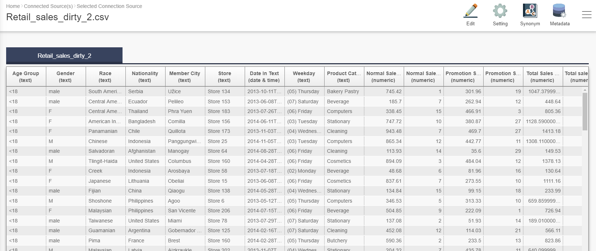

Raw data is usually dirty, meaning it consists of missing values, errors, misspellings, duplicate records, etc. Using a dirty dataset will produce inaccurate results when performing analysis. 

>Note : See if you can spot any of these "problems" in the given dataset.

There are three columns that you might have noticed to have incorrect or inconsistent values. These are:

* **Gender**
* **Normal Sales Quantity**
* **State-City**

Lets perform some data cleaning on this troublesome columns.

### 2.1)  Gender

The Gender column consists of values: M, F and male. You will need to standardize the values by changing:
* **M -> Male**
* **F -> Female**
* **male -> Male**

To edit the data, click on the "Edit" icon on the right side of the screen, the one with the pencil icon. Your data will be shown in Edit mode. Next, click on the pencil icon shown in the column header of the Gender column. Select **"Find and Replace"** from the menu displayed.

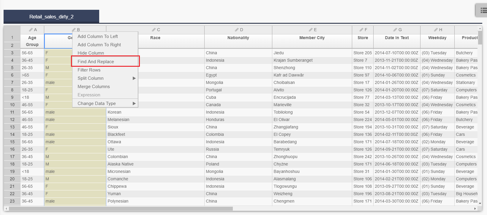

A pop up window is shown whereby you can specify conditions or rules to find and replace the values in your data set. To add a new rule, click on the **"+ Rule"** button. A list of conditions is displayed for you to specify the "**Find and Replace"** rule.

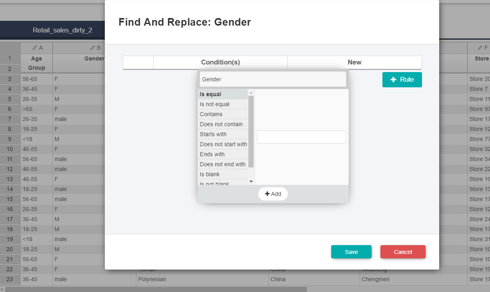

There are many ways for you to make a rule but the one you need is the **"is equal"** condition which is selected by default (when selected, it is shown in Bold). In the text box, enter **"M"** (without the quotation marks) then click **"+ Add"** button. This indicates the value in the data source that you want to change. Next, enter the word **"Male"** under the **"New"** column (again, without the quotation marks). This indicates the new value that we want to change it to.

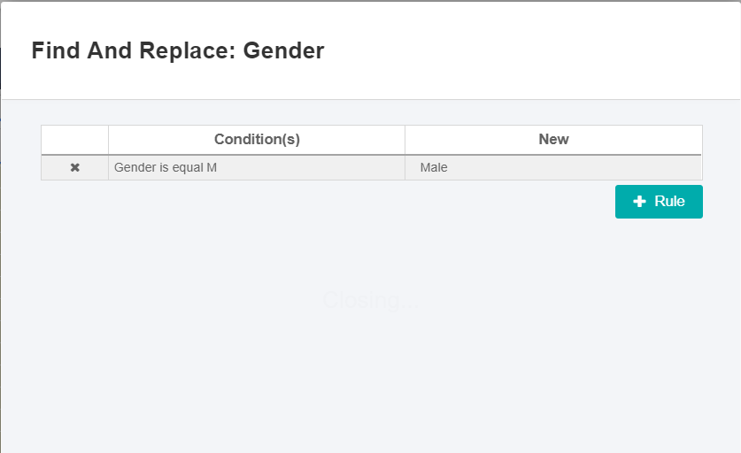

You can now save the changes made and see how the old values have been replaced in the Gender column. Reopen the **"Find and Replace"** pop up window again and add the last two rules you need to replace the **"F"** and **"male"** values, as mentioned above.

### 2.2) Normal Sales Quantity

For this column, you will need to fix the missing values. Missing values is a very common problem found in raw data. They can appear as values such as Null, NaN, -9999, 9999, etc. In this case it appears as **-9999**. To fix it, open the **"Find and Replace"** pop up window for this column. 

Create a new rule to replace the missing values with a new value i.e. the average of all the non-missing values. In this case, the average value is **8**.

You may want to use the **"is equal"** condition but you can also try the **"is less than"** condition since the sales quantity cannot be negative but the missing value is a negative number. Under the **"New"** column, type the number 8. Save the changes, afterwards you will see that all the missing values have now changed to 8.

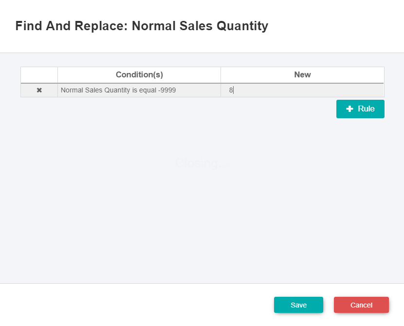

### 2.3) State-City

This column is another example of dirtyness in raw data. The values here have been combined into a single value. This may not be as useful as having them separated into two different columns.

To split them, click on the **pencil icon** shown in the State-City column header. In the menu displayed, select **"Split Column"** then select **"By Delimiter"**. The delimiter is the common character that joins the two values together. It can be just about anything but for this case, it is a Colon (which is selected by default). You can also specify other delimiter types by using the **"Other"** option.

You can leave the other default options in the screen as they are (i.e. Split from Left, into 2 columns).

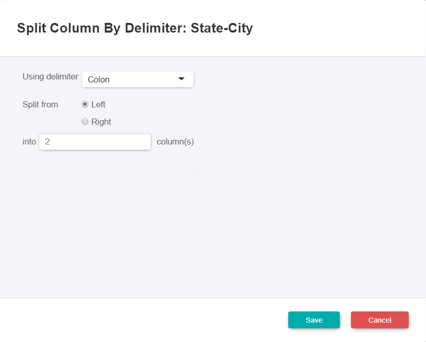

After saving the changes, you will now have two additional columns called:
* **State-City (2)**
* **State-City (3)**

Change the column names as following by double-clicking on the column, then key-in the new column name:
* **State-City (2)** -> rename to **State**
* **State-City (3)** -> rename to **City**

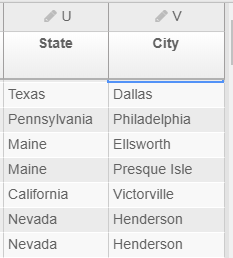

Since we don't need the original State-City column anymore, we can remove it. Right-click on the column header and select **"Hide Column"** from the menu shown.

Finally! We now have a clean dataset that's ready for analysis.

## 3) Visualising Your Data

Now that the data is clean, you can start visualising the data. To do this, click on **"My Dashboard(s)"** tab located on the left sidebar. To add a dashboard, click on the **"+ Add"** button on the top right side of the screen. Click on the **"View Dashboard"** button to go to your dashboard. 

The first thing you'll have to do is to rename your dashboard. So, click on the **"Edit"** button on the top right side of the screen. Your dashboard will be displayed in Edit mode. Double-click on the title. Enter the new name for the title and save the changes.
* **New Dashboard** -> Rename to **Retail Dashboard**

The dashboard is like a home screen where you can create and store multiple charts for a quick overview of your data.

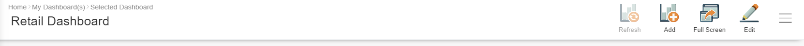

Add a chart to your dashboard by clicking on the **"+ Add"** button on the top right side of the screen. You will see a chart selection page. GIANT allows you to create many different charts but for now, we will use the trusty column chart. Select the chart titled **"Column"**, then click on the Source button shown on top right side of the screen.

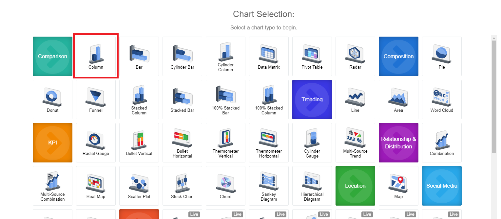

Next, select the data source (which would be the retail dataset) and then click **"Proceed"** button on the top right side of the screen.
You will see a default bar chart and a Setting bar on the right side, next to the chart.

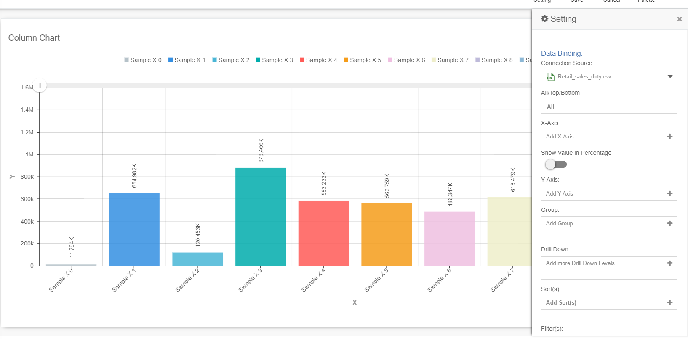

For this exercise, we will make a bar chart show the average of the total sales by age group for each product category. To do this, click the **"Add X-Axis"** field on the right side bar. Select **"Age Group"** column, then click **"+ Apply"**.

For the Y-Axis, click the **"Add Y-Axis"** field and choose the data aggregation **"Average"** (once selected, it will be shown in Bold). Then, select **"Total Sales Amount"** column and click **"+ Apply"**. Finally, we want to see the data by category so under the **"Group"** option select **"Product Category"** column.

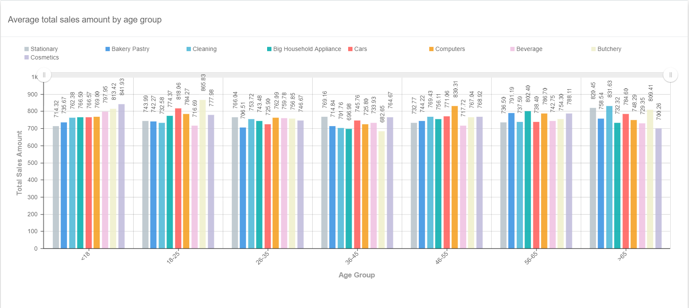

Congratulations! You have made your first chart. You can rename your chart by highlighting the title, then enter a new name for it. Save it to your dashboard by clicking **"Save"** button. Select the **"Retail Dashboard"** in the pop-up displayed, then click **"Save"** again. After that, click **"Yes"** button to view the chart added to your dashboard.

Taking a look at the chart, we can say that the average Total Sales Amount is similar across all Age Groups for every Product category. Looking at age group "<18", it seems that people in that age group spend the most buying cosmetics whereas the total spending on computers, cars, household appliances and cleaning are almost the same. Compared to those age ">65", the opposite is true whereby total spending on cosmetics is the lowest and spending on stationary is second highest. There also seems to be more variation in spending for each Product category for those in the Age Group of ">65" than the people in the Age Group of "<18".

This dataset is an artifical dataset, so we should not expect realistic relationships. In reality, the average Total Spending Amount for the Age Group of "<18" is usually significantly lower than the other Age Groups while the highest total spending are people in the Age Group of "26-35" or "36-45", also there are more variation in the difference of spending among Product categories.

## 4) Merging Data Sets

In real world analytics, you would have many data sets with each one containing data on different topics. So, you may need to combine these data sets for your analysis. This is called merging, joining or concatenation of data sets.

Follow the same procedure above to load the second data set into GIANT (i.e. US_states_statistics.csv). You will now see two data sets in **"Connect to Source(s)"** page.

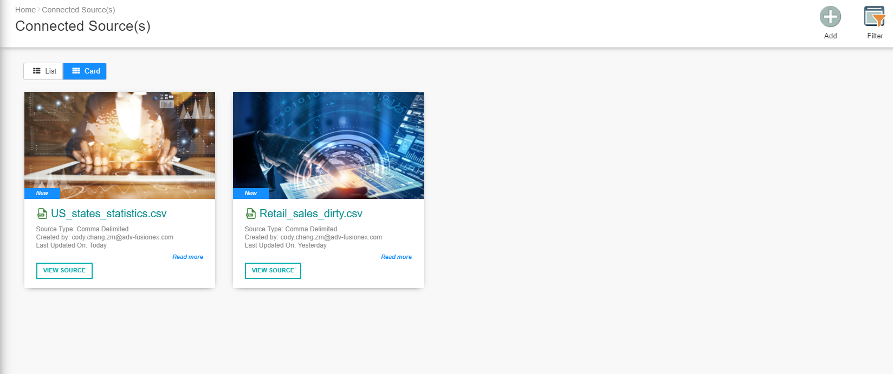

View the Retail data set and then, click on the **"Edit"** button. On the top right side of the screen, you will see a **"Merge"** button. Click on this button to proceed.

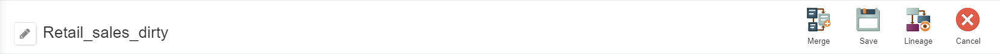

In the next screen, you will see a page that allows you to specificy how the data sets will be joined. On the left side, you should have columns from the Retail data set and on the right side, the columns from the US State Statistics data set. To join the data sets, you will need a key column that contains the same values. In this case, State is the key column and you can see that there is a blue line connecting them, indicating as such. In the center, the drop down field provide you the option to specify how the data sets will be joined. For this excercise, we will be using a **"Left join"** as we want to join the US State data set to the Retail data set.

Note : When you merge two data sets, it creates a new dataset that you have to click on in **"Connections Source(s)"** to view.

Click the "Preview" button on the top right side to see a preview of the joined data sets. You should be able to see the columns from the US State data set appended to the end of the Retail data set. After you have verified that merging is correct, click on the **"Save"** button on the top right side of the screen (not the "merge" button), to save the merge source action .

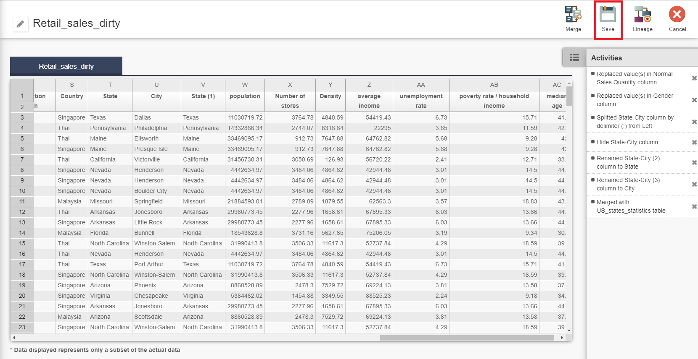

You might have noticed that the key column is now repeated twice in the merged data set. Go ahead and edit the merged data source to **hide** (right-click the column) the duplicated column. Don't forget to save the changes.

## 5) Visualising the Merged Data Set

Now, let's create a visual using the newly merged data set. Go back to your dashboard and add a new chart. Choose a **"Scatter Plot"** chart and proceed to select the data source for your chart. Make sure to select the merged data set and not the others (You will know by the icon shown to the left of the data set name. Merged data sets has the **"linked sources"** icon shown).

Select the following for the chart's data bindings:
* X-Axis: Data Aggregation - "None", Column - Average Income
* Y-Axis: Data Aggregation - "Average", Column - Total Sales Amount
* Size: Data Aggregation - "Average", Column - Total Sales Quantity
* Group: State

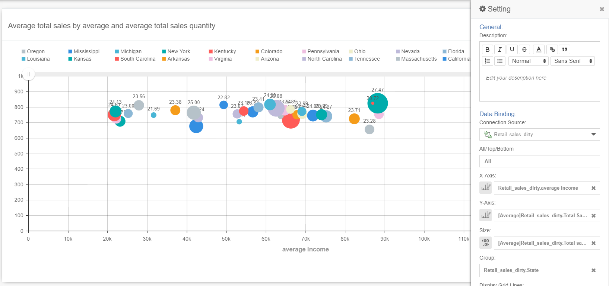

**Remember to rename your graph to reflect the data it presents.**   
Also, the Y-Axis label is automatically set to be the same as the column name (which is "Total sales amount"). But, it is actually the Average of the Total Sales Amount. Hence, it is better to hide the Y-Axis label to avoid confusion.

Click on the icon with the three vertical bars on the top right corner and select **"Axis Title"** from the menu displayed. Select the option **"No Y Axis Title"** under the Y Axis Title section.

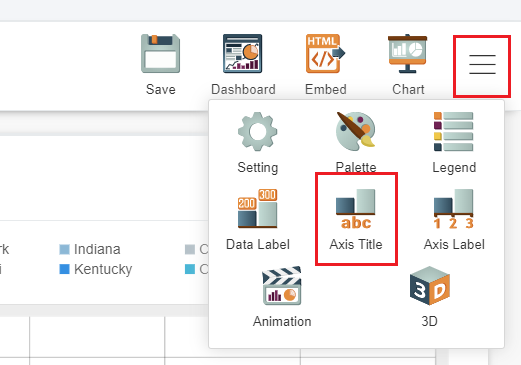

Ensure you assign an appropriate title for your graph to avoid confusion. You can hover your mouse pointer over the data points to view the values.

# Conclusion

You have now learned on how to upload your data set to GIANT, cleaned the data, merge the data sets and visualise them by creating charts with GIANT. There are many other charts you can make to gain more insight into your data. You can now try utilising other types of charts to visualise your data.
