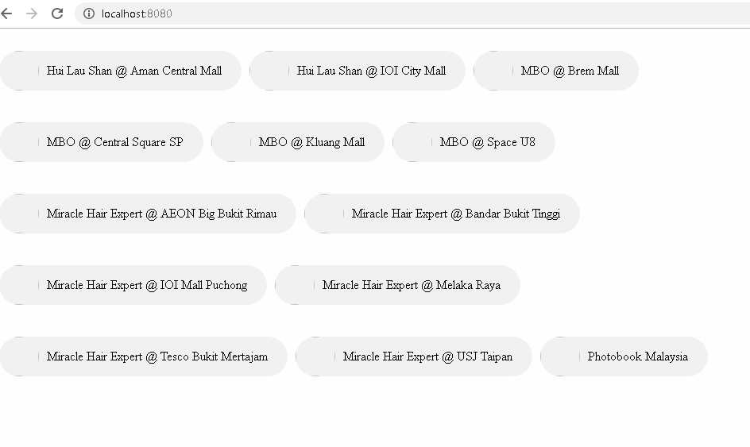

# Visual Pack 101

## Introduction
A visual pack allows the developer to teach giant to render custom and unique visuals that are data driven.

## Setting Up
1. Download the sample visual pack from [github here here](https://github.com/fx-giant/visual-pack-nodejs-sample).
> Note: you may perform `git clone` as well.

2. Unzip the sample visual pack. Next, launch Visual Studio Code and open the folder.
    
    
    
3. Open New Terminal in Visual Studio Code by clicking *Terminal* => *New Terminal*
4. In the terminal, run `npm install`.

    

5. After `npm install` is completed, run `npm run debug` and open localhost:8080 in browser to see the sample visual.

    

    
    > Debugging can be done here.
6. Follow the guide in [here](https://github.com/fx-giant/visual-pack-nodejs-sample) to upload the visual pack to GIANT. Run `npm run publish` to upload. 

    
    > **Make sure to follow the steps in the [documentation](https://github.com/fx-giant/visual-pack-nodejs-sample) before running `npm run publish`.**
7. Go to GIANT, *My Dashboard(s)* => *Add* => *VIEW DASHBOARD* => *Add*. You should see the visual pack you uploaded in the list of charts.

## Creating Contact Chips

1. Go to `src/app.js` and replace the code with the below code. This is to generate the html of the chart, we will use d3 to render the chart. Refer [here](https://d3js.org/) for more information about d3. All the render logic will be done here.

    

2. Go to `src/app.scss` and replace all the code with the below code. You can add your own css if you wish to add more styling to the visual pack. Styling of the chart will be done here.

    

3. Go to `pubish/visual/quadrant-properties.html` and replace the code with the below code. This is to change the setting panel in GIANT.

    
    
    
    
4. Go to `pubish/visual/quadrant-properties.js` and replace the code with the below code. This is to set the name of binded data and use it in `src/app.js`.

    

5. Run `npm run publish` to upload the visual pack to GIANT.
6. Using [this](./visual-pack-101.csv) as connection source, render the contact chips.

### Additional Information
- `src/app.js`: Render logic, how to use the data and create the chart.
- `src/app.scss`: Styling of chart, how to make the chart beautiful.
- `publish/visual/quadrant-properties.html`: Properties/Setting panel, what data I need to provide to render the chart.
- `publish/visual/quadrant-properties.js`: Underlying process, what are the data and its name I need from the properties panel.
