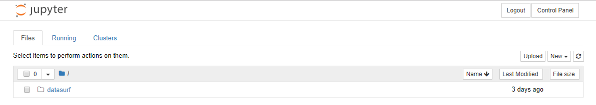
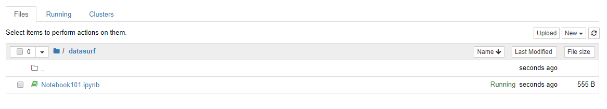

 # Hackathon: Team Share Folder 

Prerequisite:
1. Access to Jupyter 
---

### Accessing Jupyter 
1. Navigate to Jupyter [here](https://hackaton-jupyter.fusionexgiant.com/hub/login).
2. Enter Username and Password provided. 
3. Sign in to your Jupyter account.

### Identifying Share Folder 
1. Upon successful sign in, you will be prompted to a home page containing a single folder, named after your group name. 

2. The folder is a shared folder that all members of the group can view and edit files created by any of the members. 
3. This way you and your team's work is always on the same page and no need to transfer files to each other for syncing up. 
4. The image below shows an exmaple of a Notebook file inside the share folder. Thus, that file can be viewed and edited among your team members. 
