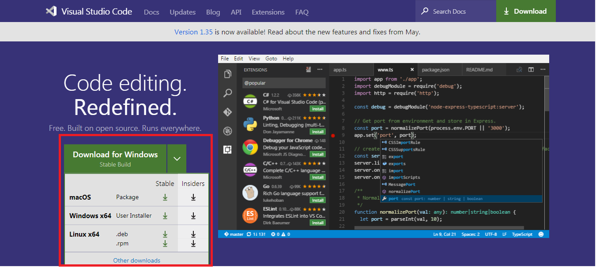

# data-hackaton-201907

## Prerequisite:
- Visual Studio Code
- NodeJS
- GIANT account

## Install Visual Studio Code
- Download installer [here](https://code.visualstudio.com/)
- Select the version for your OS/platforms. If you are using window just press **Download for Windows**.

    

- Run the installer and follow the installation prompts.

## Install NodeJS and npm
- Download installer [here](https://nodejs.org/en/)
- Select the LTS version.

    
- Run the installer and follow the installation prompts.
- Test your Nodejs and NPM installation by `node -v` and `npm -v` on terminal/command prompt.
- After the installation, `npm` command should works.

## Access to GIANT
- Get your GIANT account from person in charge.
- Go to the provided GIANT url.
- Login to your GIANT account by typing your email and password.

    
