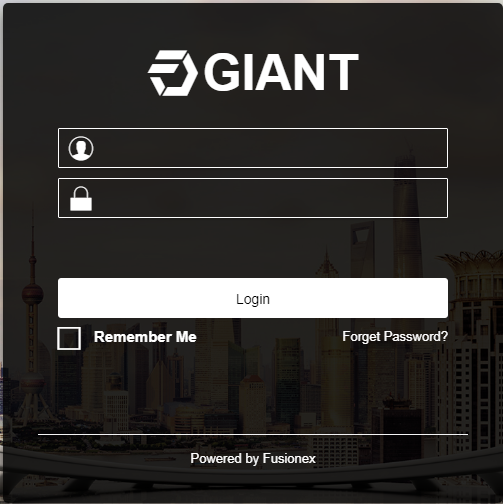

# Data Hackaton (2019/July)

## Prerequisites:
- Visual Studio Code
- NodeJS
- GIANT account

## Installing Visual Studio Code
- Download Visual Studio Code's installer [here](https://code.visualstudio.com/)
- Select the version for your OS / platforms. If you are using window just click **Download for Windows**.

    

- Run the installer and follow the installation prompts.

## Install NodeJS and NPM
- Download the NodeJS and NPM installer [here](https://nodejs.org/en/)
- Select the LTS version.

    
- Run the installer and follow the installation prompts.
- Test your Nodejs and NPM installation by typing `node -v` and `npm -v` on your terminal/command prompt. **Note** : You can find the terminal/command prompt by searching "Command prompt" in your search bar.
- After the installation, the `npm` command should work.

## Access to GIANT
- Get your GIANT account from the person in charge.
- Go to the provided GIANT url.
- Login to your GIANT account by typing your email and password.

    
