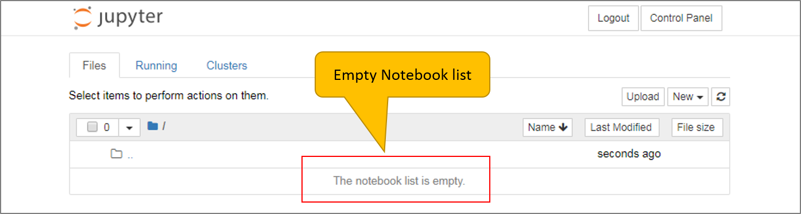

# Troubleshooting Guide

## GIANT

**Issue - Unable to Access GIANT**

**What to Do**
1) Check that you are using the correct credentials.
2) Click on the "Forget Password" link shown in the login page. In the next screen, enter the Username of your GIANT account.
 System will send a Reset Password email with instructions on resetting the password of your GIANT account.
  
 
 **Issue - Unable to Edit Source**

**What to Do**
1) Exit from the screen and try to edit another source that you uploaded. This is to check that your account is still granted with the Edit permissions.
2) Exit from the screen and check that you have the Edit button shown for the source that you want to edit.
2) Contact the Administrator for assistance.

## Jupyter Notebook (previously known as IPython Notebook)

**Issue - Unable to Access Jupyter Notebook**

**What to Do**
1) Check that you are using the correct credentials.
2) Contact the Administrator for assistance.

**Issue - Notebook List is Empty**

**What to Do**   
You need to create a new Notebook OR upload an existing Notebook. You can download sample Notebooks to upload from [here](https://github.com/fx-giant/data-hackaton-201907/tree/master/02-Python%20Notebook).

**Issue - Invalid Notebook Uploaded**

**What to Do**   
This is caused by the way you chose to download the sample Notebook. Uploading a sample Notebook downloaded directly from the link will cause this issue.

Go to the resource main screen and download all the resources as a ZIP file. Then, unzip the file to get the sample resources. Try uploading the sample Notebook again. You will be able to do so successfully.

## Visual Pack 101

**Issue - Hit Error When Running "npm install"**

**What to Do**   
You need to install nodejs. Once installation is completed, try to run the command again. Refer [here](https://github.com/fx-giant/data-hackaton-201907/blob/master/README.md) for the steps on installing nodejs.